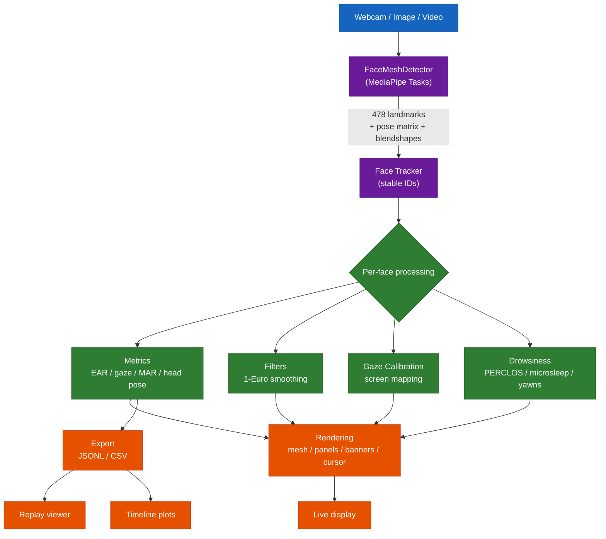

<p align="center">
  
  
  
  
  
  
  
  
  
  
  
  
</p>

# Face Mesh

Real-time facial landmark detection and analysis in Python, built on
**MediaPipe** (Tasks API) and **OpenCV**. Tracks **478 3D landmarks** per face
and layers on head pose, blink/gaze, drowsiness, and multi-face identity —
from a webcam, image, or video.

**v1.0.0** is the first stable release: an installable package, a test suite in
CI, polynomial gaze calibration with an error readout, session timeline plots,
and stable per-person tracking.


> The image above comes from `scripts/render_demo.py`, a no-camera self-test.
> Real input produces a proper face-shaped mesh.

## Features

- 478-point mesh (tesselation, contours, irises) with selectable feature sets
- Image, video, and low-latency live-stream modes; optional GPU delegate
- Head pose (pitch/yaw/roll) with a 3D gizmo and 1-Euro smoothing
- Per-eye blink counts + blinks-per-minute rate
- Gaze estimation with optional screen calibration (affine or quadratic)
- Drowsiness monitoring — PERCLOS, microsleep and yawn alerts
- Multi-face tracking that keeps metrics attached to the same person
- Export to JSONL / CSV, with an offline replay viewer and timeline plots

## Install

```bash
pip install .                 # or: pip install -e ".[dev]" for tests + plots
```

This installs the `facemesh` command. To run straight from the source tree
without installing, use `python main.py` instead.

## Quick start

```bash
facemesh                                   # live webcam mesh
facemesh --live --head-pose --blink --gaze --smooth   # everything on
facemesh --blink --drowsiness              # driver-monitoring style
facemesh --gaze --calibrate                # 9-point gaze calibration
facemesh --source photo.jpg                # annotate an image
```

Run `facemesh --help` for the full list of options. No webcam? Verify your
install with `python scripts/render_demo.py`.

Interactive keys: `q` quit · `m` mesh · `f` features · `h` head pose ·
`e` blink · `g` gaze · `d` drowsiness · `s` snapshot.

## Architecture



## Analyze a session

Export with landmarks, then replay or plot it offline — no camera or model:

```bash
facemesh --source clip.mp4 --blink --drowsiness \
    --export session.jsonl --export-landmarks
python scripts/replay.py session.jsonl          # re-render the mesh
python scripts/plot_session.py session.jsonl    # EAR / blink / PERCLOS timeline
```

## As a library

```python
import cv2
from facemesh import FaceMeshDetector, draw_face_landmarks, ensure_model

model = ensure_model()                 # downloads/caches the .task bundle
img = cv2.imread("photo.jpg")
with FaceMeshDetector(model, running_mode="image") as det:
    result = det.detect(img)
for face in result.face_landmarks:     # each face = 478 normalized landmarks
    draw_face_landmarks(img, face, ["all"])
cv2.imwrite("out.jpg", img)
```

## Notes

MediaPipe's `FaceLandmarker` returns 478 normalized landmarks per face; the
renderer maps them to pixels over the published connection topologies. The
legacy `mp.solutions.face_mesh` API was removed in MediaPipe 0.10.30+, so this
project targets the current **Tasks API**, which needs the `face_landmarker.task`
bundle — downloaded automatically on first run.

## Roadmap

Shipped through v1.0.0: head pose, blink/gaze, drowsiness, live-stream, GPU
delegate, JSONL/CSV export, replay, calibration, multi-face tracking, tests.
Next: appearance-based re-identification, a validation UI for calibration, and
richer session analytics.

## License

MIT.
