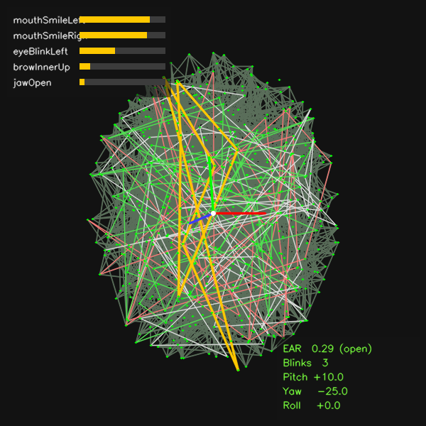

<p align="center">
  
  
  
  
  
  
  
  
  
  
  
  
</p>

# Face Mesh

Real-time facial landmark detection and mesh overlay in Python, built on
**MediaPipe** (Tasks API) and **OpenCV**. Detects **478 3D landmarks** per
face — including refined iris points — and renders the tesselation, feature
contours, and irises live from a webcam, an image, or a video file.

This is **v0.4.0** — adds gaze screen-calibration, drowsiness monitoring,
multi-face panels, a GPU-delegate option, and an offline replay viewer.



> The image above is the output of `scripts/render_demo.py`, a no-camera
> self-test that draws synthetic landmarks. Real input produces a proper
> face-shaped mesh.

## Features

- 478-point face mesh (tesselation, contours, irises) with selectable feature sets
- Three running modes: **image**, **video**, and low-latency **live-stream**
- Multi-face tracking with a **metrics panel per face** *(new)*
- **Head-pose estimation** — pitch / yaw / roll, 3D gizmo, optional 1-Euro smoothing
- **Blink detection** — per-eye counts plus a rolling blinks-per-minute rate
- **Gaze estimation** — direction from iris position, with optional **screen calibration** + gaze cursor *(calibration new)*
- **Drowsiness monitoring** — PERCLOS, microsleep and yawn detection with alerts *(new)*
- **Per-frame export** to JSONL or CSV, plus an **offline replay viewer** *(replay new)*
- Optional **GPU delegate** (falls back to CPU) *(new)*
- Optional expression blendshapes overlay
- Automatic one-time model download; small, documented codebase

## Requirements

- Python 3.9–3.12
- A webcam (only for live mode)

Install dependencies:

```bash
pip install -r requirements.txt
```

> `requirements.txt` uses `opencv-python` (with GUI support) so the live
> window works. On a headless server, swap it for `opencv-python-headless`
> and run with `--no-display --output ...`.

## Quick start

```bash
# Live webcam (device 0). The model auto-downloads on first run.
python main.py

# Annotate a single image -> writes photo_mesh.jpg next to it
python main.py --source photo.jpg

# Annotate a video -> writes an output file
python main.py --source clip.mp4 --output clip_mesh.mp4

# Show expression blendshapes and track up to two faces
python main.py --blendshapes --num-faces 2

# Just the iris + eye/lip contours, no full tesselation
python main.py --features contours

# Everything on, low-latency live-stream mode, smoothed head pose
python main.py --live --head-pose --blink --gaze --smooth

# Driver-monitoring style drowsiness detection (PERCLOS / microsleep / yawns)
python main.py --blink --drowsiness

# Calibrate gaze to your screen (9-point), then show a gaze cursor
python main.py --gaze --calibrate --save-calibration cal.json
python main.py --gaze --load-calibration cal.json

# Track several faces, one panel each
python main.py --num-faces 3 --blink --multiface

# Try the GPU delegate (falls back to CPU if unavailable)
python main.py --gpu --head-pose

# Export a session with landmarks to CSV or JSONL...
python main.py --source clip.mp4 --head-pose --blink --gaze --export metrics.csv

# ...or export JSONL with landmarks and replay it offline (no camera/model)
python main.py --source clip.mp4 --blink --gaze --export session.jsonl --export-landmarks
python scripts/replay.py session.jsonl
```

No webcam handy? Verify your install renders correctly with:

```bash
python scripts/render_demo.py   # writes render_demo.png
```

## Interactive keys (live window)

| Key | Action                          |
|-----|---------------------------------|
| `q` / `Esc` | Quit                    |
| `m` | Toggle the mesh on/off          |
| `f` | Cycle features (all → tesselation → contours → irises) |
| `p` | Toggle landmark points          |
| `b` | Toggle the blendshapes overlay  |
| `h` | Toggle the head-pose gizmo (needs `--head-pose` at launch) |
| `e` | Toggle blink/EAR metrics        |
| `g` | Toggle gaze estimation          |
| `d` | Toggle drowsiness monitoring    |
| `s` | Save a snapshot (`snapshot_NNN.jpg`) |

## Command-line options

| Flag | Default | Description |
|------|---------|-------------|
| `--source` | `0` | Webcam index, or path to image/video (or a stream URL) |
| `--model` | auto | Path to `face_landmarker.task` (downloaded if omitted) |
| `--features` | `all` | `tesselation` · `contours` · `irises` · `all` |
| `--num-faces` | `1` | Max faces to track |
| `--live` | off | Low-latency LIVE_STREAM mode (webcam only) |
| `--gpu` | off | Try the GPU delegate (falls back to CPU) |
| `--points` | off | Plot a dot at every landmark |
| `--blendshapes` | off | Show top expression blendshapes |
| `--head-pose` | off | Estimate pitch/yaw/roll and draw a 3D gizmo |
| `--smooth` | off | 1-Euro filter on head-pose angles |
| `--blink` | off | Per-eye EAR, blink counts and rate |
| `--gaze` | off | Estimate gaze direction from the irises |
| `--drowsiness` | off | PERCLOS / microsleep / yawn alerts |
| `--multiface` | off | A metrics panel per face (auto when num-faces>1) |
| `--calibrate` | off | Run a 9-point gaze calibration first (webcam) |
| `--save-calibration` | — | Save the fitted gaze calibration to JSON |
| `--load-calibration` | — | Load a saved gaze calibration (skips `--calibrate`) |
| `--ear-threshold` | `0.21` | EAR below this counts as a closed eye |
| `--det-conf` | `0.5` | Min face-detection confidence |
| `--track-conf` | `0.5` | Min tracking confidence (video/live) |
| `--output` | — | Write annotated result to this path |
| `--export` | — | Per-frame metrics to `.jsonl` or `.csv` (by extension) |
| `--export-landmarks` | off | Include the 478 landmarks per face in the export |
| `--no-display` | off | Process without opening a window |

## Project structure

```
face-mesh/
├── main.py                 # CLI entry point (webcam / image / video)
├── requirements.txt
├── scripts/
│   ├── render_demo.py      # no-camera render self-test
│   └── replay.py           # offline replay of an exported .jsonl session
└── src/
    ├── detector.py         # FaceMeshDetector — image/video/live, CPU or GPU
    ├── drawing.py          # mesh / gizmo / gaze / panels / banners
    ├── metrics.py          # EAR, blink tracker, gaze, MAR, head-pose decomp
    ├── filters.py          # 1-Euro filter + pose smoother
    ├── calibration.py      # gaze -> screen affine calibration
    ├── drowsiness.py       # PERCLOS / microsleep / yawn monitor
    ├── export.py           # per-frame JSONL / CSV writers
    ├── model.py            # model download & caching
    └── utils.py            # FPS meter, source resolution
```

## Replaying a session

Export with landmarks, then play it back with no camera or model:

```bash
python main.py --source clip.mp4 --blink --gaze --head-pose \
    --export session.jsonl --export-landmarks
python scripts/replay.py session.jsonl                 # live window
python scripts/replay.py session.jsonl --output replay.mp4 --no-display
```

## Use it as a library

```python
import cv2
from src import FaceMeshDetector, draw_face_landmarks, ensure_model

model = ensure_model()                      # downloads/caches the .task bundle
img = cv2.imread("photo.jpg")

with FaceMeshDetector(model, running_mode="image") as det:
    result = det.detect(img)

for face in result.face_landmarks:          # each face = 478 normalized landmarks
    draw_face_landmarks(img, face, ["all"])

cv2.imwrite("out.jpg", img)
```

## How it works

MediaPipe's `FaceLandmarker` runs a detection + landmark-regression graph and
returns 478 normalized `(x, y, z)` landmarks per face. The renderer maps those
to pixels and draws lines over the published connection topologies
(`FACE_LANDMARKS_TESSELATION`, `..._LIPS`, `..._LEFT_IRIS`, etc.). Webcam and
video files run in **VIDEO** mode for temporal tracking; images run in
**IMAGE** mode.

> **Note on MediaPipe versions:** the older `mp.solutions.face_mesh` API was
> removed in MediaPipe 0.10.30+. This project targets the current **Tasks API**
> (`mediapipe.tasks.python.vision.FaceLandmarker`), which needs the
> `face_landmarker.task` model bundle — handled automatically by `src/model.py`.

## Roadmap ideas

Done in v0.2: head-pose (pitch/yaw/roll + gizmo), blink/EAR, JSONL export.
Done in v0.3: live-stream mode, gaze direction, per-eye blink + rate, 1-Euro
head-pose smoothing, CSV export.
Done in v0.4: gaze screen-calibration, drowsiness (PERCLOS/microsleep/yawns),
multi-face panels, GPU delegate, offline replay viewer.

Next up:

- Package properly (pyproject, `pip install`, console entry point)
- Unit-test suite in CI (the metrics/filters/calibration math is pure and testable)
- Polynomial gaze mapping + validation error readout
- Timeline plots (EAR / PERCLOS over a session) from the exported data
- Face recognition/ID so multi-face metrics stick to the same person over time

## License

MIT — do whatever you like; no warranty.
